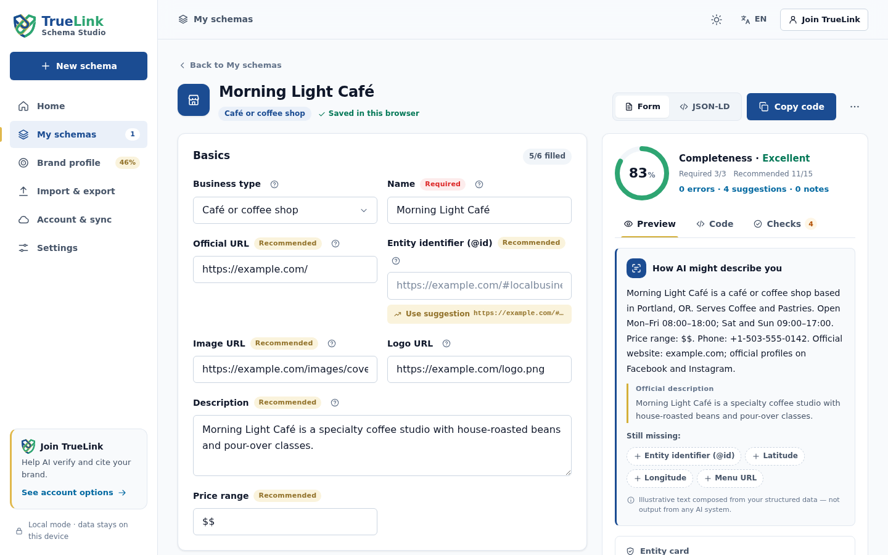

<p align="center">
  
</p>

<h1 align="center">TrueLink Schema Studio</h1>

<p align="center">
  <b>A free, open-source workspace for Schema.org structured data (JSON-LD).</b><br>
  Build your brand's structured data with guided forms, get instant checks, and preview what
  search engines and AI assistants can read about you. No sign-up; your data stays in your browser.
</p>

<p align="center">
  <a href="https://johnny050033.github.io/truelink-schema-web-tools/"><b>Try it in your browser →</b></a>
  &nbsp;·&nbsp; <a href="#features">Features</a>
  &nbsp;·&nbsp; <a href="#use-the-core-in-your-project">Developers</a>
  &nbsp;·&nbsp; <a href="CONTRIBUTING.md">Contribute</a>
  &nbsp;·&nbsp; <a href="README.zh-TW.md">繁體中文</a>
</p>

<p align="center">
  <a href="https://github.com/Johnny050033/truelink-schema-web-tools/actions/workflows/ci.yml"></a>
  <a href="LICENSE"></a>
  
  <a href="CONTRIBUTING.md"></a>
</p>

<p align="center">
  
</p>

## Why

Structured data tells search engines and AI assistants who you are: your organization,
locations, people, products, events and answers. Written by hand, JSON-LD is easy to get
subtly wrong (a missing time zone, a relative URL, a price with a currency sign), and hard to
review.

Schema Studio gives you:

- **guided forms** built from documented requirements
- **checks** that explain what to fix and why
- a **plain-language preview** of what machines can read about you

It's advice, not a promise: structured data can help machines understand your brand, but no
tool can guarantee rankings, rich results or AI citations.

## Features

- **11 guided templates:** Organization, LocalBusiness (with subtypes), Person, WebSite,
  Service, Product, Article, FAQPage, Event, BreadcrumbList, plus any other type through a
  generic template.
- **Brand profile once, reused everywhere:** your name, logo, address and official profiles
  fill new documents automatically.
- **Instant, explained checks:**
  - required and recommended properties
  - URLs, ISO dates with time zones, international phone numbers, currencies, languages
    and opening hours
  - an advisory completeness score
- **"What machines can read" preview:** readable sentences, key facts and a search-result
  preview, rendered as text only.
- **Import and export:**
  - Import pasted JSON-LD, a full page's HTML source or TrueLink web tool data (bounded
    and previewed first).
  - Export JSON-LD, a ready `<script>` tag or full backups.
- **Private by design:** no tracking or analytics, no server calls, a strict Content
  Security Policy, and data kept in your browser.
- **Installable and offline:** a PWA for desktop and mobile.
- **7 languages:** see [below](#languages).
- **TrueLink Verified Schema API (KYC):** after identity verification, TrueLink serves your
  complete schema only on your verified official domains. Phishing copies get nothing, and
  anyone can check which site is really yours. [How it works →](docs/VERIFIED_SCHEMA_API.md)
- **Optional TrueLink account:** cloud drafts across devices, hosted deployment and AI
  visibility tools on the [TrueLink platform](https://truelink-group.com/en/). Nothing
  uploads without an explicit click.

## TrueLink Verified Schema API

Anyone can copy JSON-LD onto a look-alike site, and crawlers can't tell which copy is genuine.
TrueLink ties your structured data to a verified identity:

1. **KYC:** verify your company, expertise or identity on TrueLink.
2. **Bind your domains:** TrueLink serves your schema, from a one-line embed or a keyed
   server-side API, only to your verified official domains. A copy elsewhere gets nothing,
   and you are alerted.
3. **Public verification:** crawlers, AI assistants and people can confirm that a domain is a
   verified official site (`/api/public/cert-status`, `/api/public/verified-entities.jsonld`).

The shared core implements the same domain rules as the platform (`isAllowedHost`,
`certStatusUrl`, `hostedSchemaEmbed` …). Signed-in members manage KYC status, the embed line and
API keys from Schema Studio. Identity documents go only to TrueLink's KYC page.

**[Get verified on TrueLink →](https://truelink-group.com/)** ·
[Technical overview](docs/VERIFIED_SCHEMA_API.md) ·
[繁體中文說明](docs/VERIFIED_SCHEMA_API.zh-TW.md)

## Languages

| Language | Status |
| --- | --- |
| English | source |
| 繁體中文 (Traditional Chinese) | source |
| 简体中文 (Simplified Chinese) | beta |
| 日本語 (Japanese) | beta |
| Español (Spanish) | beta |
| Português (Brasil) | beta |
| Bahasa Indonesia | beta |

Beta languages were translated with AI assistance and are waiting for native-speaker review.
**Reviewing a language is one of the most helpful contributions you can make.** See
[Translations](CONTRIBUTING.md#translations). Schema Studio picks your browser language
automatically; change it anytime from the language menu.

## Use it

- **In the browser:** open the [live demo](https://johnny050033.github.io/truelink-schema-web-tools/).
  It's the full app; everything stays on your device.
- **As an app:** in Chrome or Edge choose *Install*; on iOS use *Share → Add to Home Screen*.
- **Locally:**

  ```sh
  pnpm install --frozen-lockfile && pnpm dev   # http://localhost:5173
  ```

## Use the core in your project

The engine behind the Studio is a separate, dependency-free package, `truelink-schema-document`.
The TrueLink web tool uses the same package, so every tool gives the same checks and output.

```ts
import { auditDocument, buildOutput, createDocumentData, describeDocument, getTemplate, toJsonLdScript } from 'truelink-schema-document';

const template = getTemplate('local-business');
const data = { ...createDocumentData('local-business', { locale: 'en' }), name: 'Morning Light Café', url: 'https://example.com/' };

auditDocument(template, data);                            // { score, grade, issues, missing, … }: advisory
describeDocument(template, data, 'en').sentences;         // ["Morning Light Café is a local business.", …]
toJsonLdScript(buildOutput(data, template));              // <script type="application/ld+json">…</script>
```

Tagged [releases](https://github.com/Johnny050033/truelink-schema-web-tools/releases) ship:

- ESM, CommonJS and browser-global builds (`window.TrueLinkSchema`)
- translation catalogs
- conformance cases
- npm tarballs

The packages aren't on the npm registry yet.

| Workspace | What it is |
| --- | --- |
| [`packages/schema-document`](packages/schema-document/README.md) | Shared core: templates, checks, descriptions, bounded import, safe `<script>` output, the `SchemaDocumentRecord` contract and translations |
| [`packages/cloud-client`](packages/cloud-client/README.md) | `truelink-schema-cloud`: the host-bridge protocol for optional TrueLink cloud drafts |
| [`apps/web`](apps/web/README.md) | Schema Studio (React PWA) |
| [`/` root](docs/LIBRARY.md) | Strict flat-object validation and sandboxed static embeds |

How the pieces fit together: [docs/ARCHITECTURE.md](docs/ARCHITECTURE.md).

## Develop

Requires Node.js **22.13+** and **pnpm 11.19.0**.

```sh
git clone https://github.com/Johnny050033/truelink-schema-web-tools.git
cd truelink-schema-web-tools
pnpm install --frozen-lockfile
pnpm check   # typecheck, translation checks, tests and builds for every workspace
```

CI runs `pnpm check` on every pull request. Pushes to `main` deploy the demo to GitHub
Pages, and `v*` tags publish release artifacts.

## Contributing

Ideas, bug reports, templates and translations are all welcome:

- Start with [CONTRIBUTING.md](CONTRIBUTING.md).
- Looking for a first task? Try the [good first issues](https://github.com/Johnny050033/truelink-schema-web-tools/issues?q=is%3Aissue+is%3Aopen+label%3A%22good+first+issue%22).
  Native-speaker reviews of the Japanese, Spanish, Portuguese and Indonesian translations are especially welcome.
- Or open an [issue](https://github.com/Johnny050033/truelink-schema-web-tools/issues/new/choose).
- Report security problems privately ([SECURITY.md](SECURITY.md)).
- Everyone participating agrees to the [Code of Conduct](CODE_OF_CONDUCT.md).

If Schema Studio is useful to you, a ⭐ helps others find it.

## About TrueLink

Schema Studio is made by [TrueLink](https://truelink-group.com/en/), the AI Trust Engine.
TrueLink helps brands organize verifiable identity, content and official profiles, so AI
engines can find, verify and cite them. This repository contains no TrueLink backend code,
credentials or customer data.

## License

The code is [MIT licensed](LICENSE). The TrueLink name, shield logo and app icons are **not**
covered by the MIT License; see [TRADEMARKS.md](TRADEMARKS.md) before redistributing a fork.
