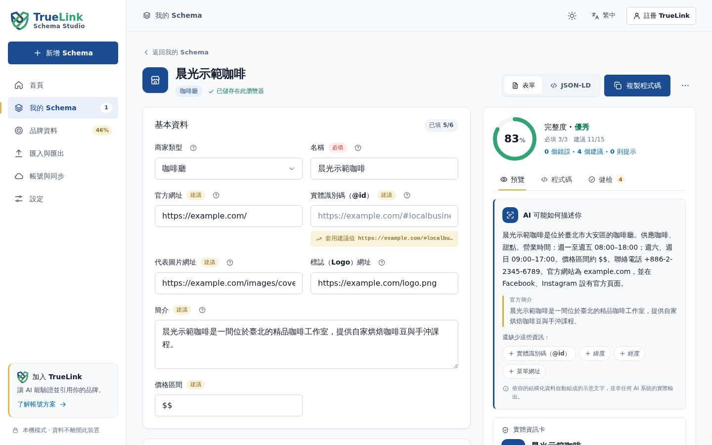

<p align="center">
  
</p>

<h1 align="center">TrueLink Schema Studio</h1>

<p align="center">
  <b>免費、開源的 Schema.org 結構化資料（JSON-LD）工作台。</b><br>
  用引導式表單建立品牌結構化資料、即時健檢，並預覽搜尋引擎與 AI 助理可能讀到的內容。免註冊，資料只存在你的瀏覽器。
</p>

<p align="center">
  <a href="https://johnny050033.github.io/truelink-schema-web-tools/"><b>立即在瀏覽器試用 →</b></a>
  &nbsp;·&nbsp; <a href="#功能">功能</a>
  &nbsp;·&nbsp; <a href="#在你的專案使用核心套件">開發者</a>
  &nbsp;·&nbsp; <a href="CONTRIBUTING.md">參與貢獻</a>
  &nbsp;·&nbsp; <a href="README.md">English</a>
</p>

<p align="center">
  
</p>

## 為什麼需要它

結構化資料能告訴搜尋引擎與 AI 助理「你是誰」：品牌、據點、人物、產品、活動與常見問答。
手寫 JSON-LD 很容易出小錯，例如少了時區、用了相對網址、價格加了幣別符號，也很難檢查。

Schema Studio 依官方文件設計引導式表單，檢查時說明要改什麼、為什麼，並用白話預覽機器能讀到的內容。
這是建議，不是保證：結構化資料可以幫助機器理解品牌，但沒有任何工具能保證排名、複合式搜尋結果或 AI 引用。

## 功能

- **11 種引導式模板**：Organization、LocalBusiness（含子類型）、Person、WebSite、Service、
  Product、Article、FAQPage、Event、BreadcrumbList。其他類型可用通用模板。
- **品牌資料填一次，到處沿用**：名稱、Logo、地址與官方社群，新文件會自動帶入。
- **即時、有說明的檢查**：
  - 必填與建議欄位
  - 網址、含時區的日期、國際電話、幣別、語言與營業時間格式
  - 參考用的完整度分數
- **「機器可讀內容」預覽**：以白話句子、重點資訊與搜尋結果外觀呈現，只顯示純文字。
- **匯入與匯出**：
  - 可匯入 JSON-LD、整頁 HTML 原始碼或 TrueLink 網頁工具資料；有大小上限，匯入前可先預覽。
  - 可匯出 JSON-LD、`<script>` 標籤或完整備份。
- **隱私優先**：沒有追蹤或分析、不呼叫伺服器、嚴格的內容安全政策，資料留在瀏覽器。
- **可安裝、可離線**：桌機與手機都能安裝成 App（PWA）。
- **7 種語言**：見[下方](#語言)。
- **TrueLink 認證 Schema API（KYC）**：通過身分認證後，TrueLink 只在你認證過的官方網域提供完整 Schema。
  釣魚網站複製了也拿不到資料，任何人都能查證哪個才是真官網。[運作方式 →](docs/VERIFIED_SCHEMA_API.zh-TW.md)
- **選用 TrueLink 帳號**：在 [TrueLink 平台](https://truelink-group.com/)使用跨裝置雲端草稿、
  代管部署與 AI 能見度工具。必須明確按下按鈕才會上傳。

## TrueLink 認證 Schema API

任何人都能把 JSON-LD 複製到仿冒網站，爬蟲分不出哪份才是真的。TrueLink 把結構化資料和已認證的身分綁在一起：

1. **KYC**：在 TrueLink 認證你的企業、專家或個人身分。
2. **綁定網域**：TrueLink 透過一行嵌入碼或伺服器端金鑰 API 提供你的 Schema，只提供給認證過的官方網域。
   其他網站複製了也拿不到，你還會收到警示。
3. **公開查證**：爬蟲、AI 助理與訪客都能確認某個網域是否為認證官網。

共用核心實作與平台相同的網域規則。已登入的會員可以在 Schema Studio 查看 KYC 狀態、嵌入碼並管理 API 金鑰；
身分文件只會上傳到 TrueLink 的 KYC 頁面。

**[前往 TrueLink 認證 →](https://truelink-group.com/)** · [完整說明](docs/VERIFIED_SCHEMA_API.zh-TW.md)

## 語言

| 語言 | 狀態 |
| --- | --- |
| English | 原文 |
| 繁體中文 | 原文 |
| 简体中文 | Beta |
| 日本語 | Beta |
| Español | Beta |
| Português (Brasil) | Beta |
| Bahasa Indonesia | Beta |

Beta 語言由 AI 協助翻譯，等待母語人士審閱。**審閱一種語言是非常有價值的貢獻**，
請見 [CONTRIBUTING.md 的 Translations](CONTRIBUTING.md#translations)。
Schema Studio 會依瀏覽器語言自動選擇介面語言，也可以隨時從語言選單切換。

## 使用方式

- **瀏覽器**：開啟[線上版](https://johnny050033.github.io/truelink-schema-web-tools/)。
  這是完整的 App，所有資料都留在你的裝置。
- **安裝成 App**：Chrome／Edge 選擇「安裝」；iOS 使用「分享 → 加入主畫面」。
- **本機執行**：

  ```sh
  pnpm install --frozen-lockfile && pnpm dev   # http://localhost:5173
  ```

## 在你的專案使用核心套件

Studio 背後的引擎是獨立、零相依的 `truelink-schema-document`。TrueLink 網頁工具也使用同一個套件，
所以各工具的檢查與輸出一致。用法請見 [README.md](README.md#use-the-core-in-your-project)；
架構說明請見 [docs/ARCHITECTURE.md](docs/ARCHITECTURE.md)（英文），
多平台策略請見 [docs/PLATFORM_STRATEGY.zh-TW.md](docs/PLATFORM_STRATEGY.zh-TW.md)。

## 開發

需要 Node.js **22.13+** 與 **pnpm 11.19.0**。

```sh
git clone https://github.com/Johnny050033/truelink-schema-web-tools.git
cd truelink-schema-web-tools
pnpm install --frozen-lockfile
pnpm check   # 所有工作區的型別檢查、翻譯檢查、測試與建置
```

## 參與貢獻

歡迎各種點子、問題回報、模板建議與翻譯：

- 請先閱讀 [CONTRIBUTING.md](CONTRIBUTING.md)（英文）。
- 想找入門任務？請看 [good first issues](https://github.com/Johnny050033/truelink-schema-web-tools/issues?q=is%3Aissue+is%3Aopen+label%3A%22good+first+issue%22)，
  特別歡迎母語人士審閱日文、西班牙文、葡萄牙文與印尼文翻譯。
- 或[開一個 issue](https://github.com/Johnny050033/truelink-schema-web-tools/issues/new/choose)。
- 安全性問題請私下回報（[SECURITY.md](SECURITY.md)）。

覺得好用的話，按一顆 ⭐ 能幫助更多人找到它。

## 關於 TrueLink

Schema Studio 由 [TrueLink](https://truelink-group.com/)（The AI Trust Engine）開發。
TrueLink 協助品牌整理可驗證的身分、內容與官方社群，讓 AI 引擎能找到、驗證並引用。
本儲存庫不含 TrueLink 後端程式、憑證或客戶資料。

## 授權

程式碼採 [MIT 授權](LICENSE)。TrueLink 名稱、盾牌標誌與 App 圖示**不在** MIT 授權範圍內；
散布分支前請先閱讀 [TRADEMARKS.md](TRADEMARKS.md)。
